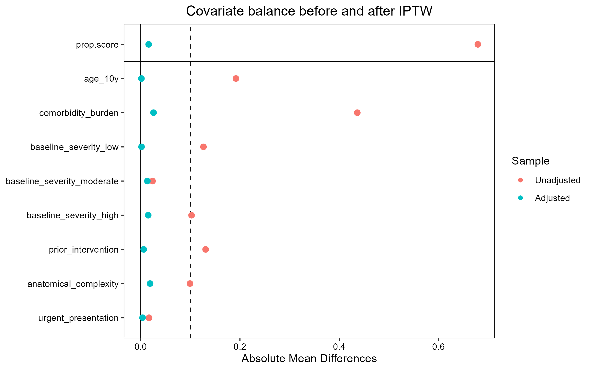
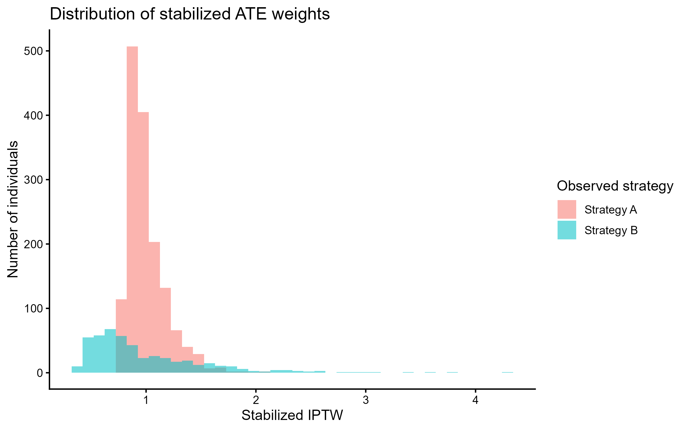
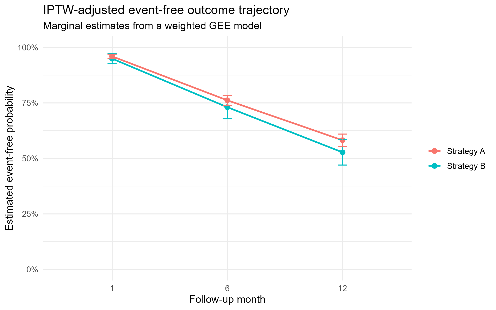
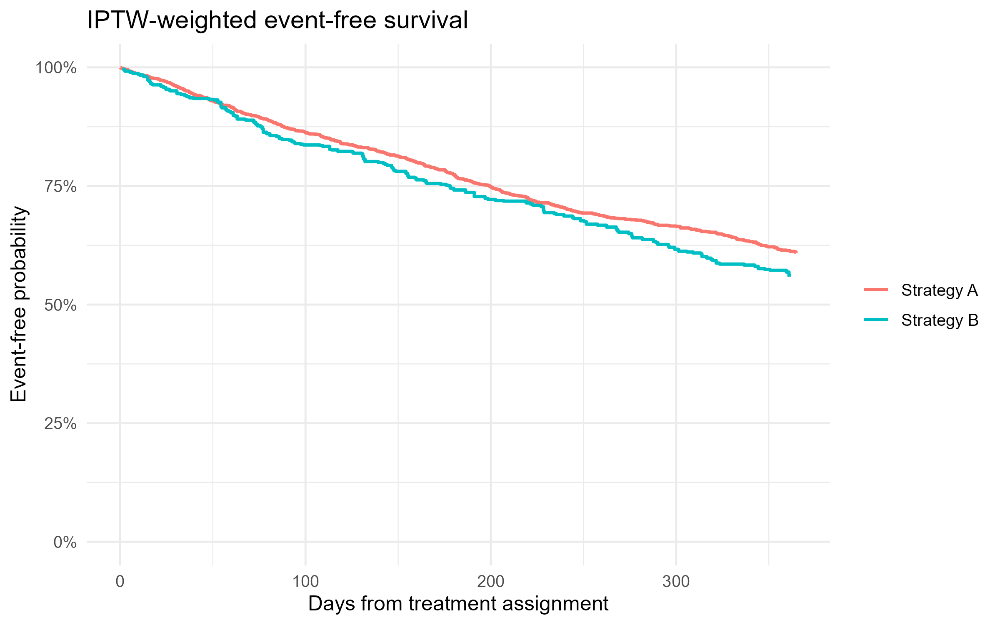

```{r setup, include=FALSE}
knitr::opts_chunk$set(
  echo = TRUE,
  message = FALSE,
  warning = FALSE,
  fig.width = 9,
  fig.height = 5.5,
  out.width = "100%"
)

if (!file.exists("run_all.R")) {
  stop("Render this report from the repository root.")
}

source("run_all.R")

cohort <- readr::read_csv("data/synthetic_cohort_weighted.csv", show_col_types = FALSE)
outcomes <- readr::read_csv("data/synthetic_longitudinal_outcomes.csv", show_col_types = FALSE)
truth <- readr::read_csv("data/simulation_truth.csv", show_col_types = FALSE)
weighted_rates <- readr::read_csv("outputs/weighted_longitudinal_rates.csv", show_col_types = FALSE)
weighted_rd <- readr::read_csv("outputs/weighted_longitudinal_risk_differences.csv", show_col_types = FALSE)
cox_results <- readr::read_csv("outputs/weighted_cox_model.csv", show_col_types = FALSE)
weight_sensitivity <- readr::read_csv("outputs/weight_sensitivity_summary.csv", show_col_types = FALSE)
```

# Executive summary

This report demonstrates an end-to-end workflow for estimating treatment effects from observational longitudinal data. The analysis uses **entirely synthetic data** generated by the repository. No patient-level data, confidential data, or results from an external study are included.

The central problem is confounding by indication: individuals with higher baseline risk are more likely to receive Strategy A, so a crude comparison between strategies does not estimate a causal effect. The workflow estimates stabilized inverse probability of treatment weights (IPTW) for the average treatment effect (ATE), checks covariate balance, and then estimates longitudinal and survival outcomes.

The primary estimand is the ATE at 12 months:

$$
\mathrm{ATE}_{365} =
\mathbb{E}\left[Y^{(A)}(365) - Y^{(B)}(365)\right].
$$

Because the data-generating process defines potential outcomes under both strategies, the simulation's known 365-day causal effect is `r scales::percent(truth$true_value, accuracy = 0.1)` in event-free probability for Strategy A minus Strategy B.

# Data-generating process

Each simulated individual enters the cohort at a common time zero and receives either Strategy A or Strategy B. The following variables are measured before strategy assignment:

- age;
- comorbidity burden;
- baseline severity;
- history of prior intervention;
- anatomical complexity; and
- urgency of presentation.

These covariates influence both treatment selection and the event hazard. This intentionally creates a setting in which crude outcome comparisons are biased. The simulation also includes administrative censoring and incomplete follow-up.

The full specification is available in [`docs/data_generating_process.md`](docs/data_generating_process.md).

```{r cohort-summary, echo=FALSE}
raw_summary <- outcomes %>%
  dplyr::filter(follow_up_month == 12, !is.na(event_free)) %>%
  dplyr::group_by(strategy) %>%
  dplyr::summarise(
    n_observed = dplyr::n(),
    crude_event_free_probability = mean(event_free),
    .groups = "drop"
  )

knitr::kable(
  raw_summary,
  digits = 3,
  caption = "Observed 12-month event-free outcome before adjustment"
)
```

# Propensity-score weighting and diagnostics

The propensity score models the probability of receiving Strategy A given pre-treatment covariates. Stabilized ATE weights create a weighted pseudo-population in which the measured baseline covariates should be balanced between strategies.

The standardized mean difference threshold used here is 0.10. Balance is a diagnostic, not proof that all confounding has been removed.

```{r love-plot, echo=FALSE}

```

```{r weight-plot, echo=FALSE}

```

# Longitudinal marginal outcome model

The repeated binary event-free outcome is modeled with an IPTW-weighted generalized estimating equation (GEE), using an exchangeable working correlation. This targets population-average outcome trajectories rather than subject-specific effects.

```{r trajectory-plot, echo=FALSE}

```

```{r risk-differences, echo=FALSE}
knitr::kable(
  weighted_rd,
  digits = 3,
  caption = "IPTW-weighted risk differences from the marginal GEE model"
)
```

# Time-to-event analysis

The survival analysis estimates weighted event-free curves and a robust weighted Cox model. It complements the scheduled-visit outcome analysis by using the observed event or censoring time.

```{r survival-plot, echo=FALSE}

```

```{r cox-results, echo=FALSE}
knitr::kable(
  cox_results,
  digits = 3,
  caption = "Robust IPTW-weighted Cox model"
)
```

# Weight sensitivity analysis

Extreme weights can reduce effective sample size and make estimates unstable. The workflow therefore compares stabilized ATE weights with a lightly trimmed version.

```{r sensitivity-table, echo=FALSE}
knitr::kable(
  weight_sensitivity,
  digits = 3,
  caption = "Distribution and effective sample size of alternative weight specifications"
)
```

# Interpretation and limitations

The workflow illustrates the distinction between prediction and causal estimation. A model that predicts treatment assignment or outcome well is not, by itself, sufficient to identify an ATE. The analytical design must also define a time zero, restrict adjustment to pre-treatment covariates, assess overlap, and state the causal assumptions.

The analysis remains conditional on no important unmeasured confounding, positivity, consistency, and appropriate model specification. Missing follow-up is simulated and the longitudinal model uses observed assessments; a fuller applied analysis could extend the workflow with inverse probability of observation weights.

This case study is intended to demonstrate reproducible causal analysis, not to make clinical or policy recommendations.

# Reproducibility

The synthetic cohort, figures, and tables are regenerated from a fixed random seed. To rebuild the analysis and render this report from the repository root:

```r
source("run_all.R")
rmarkdown::render(
  "analysis_report.Rmd",
  output_file = "index.html",
  output_dir = "docs"
)
```

The full code is organized into separate scripts for simulation, weighting, longitudinal estimation, survival analysis, and sensitivity analyses. Use the code-folding control in the HTML report to inspect implementation details.

